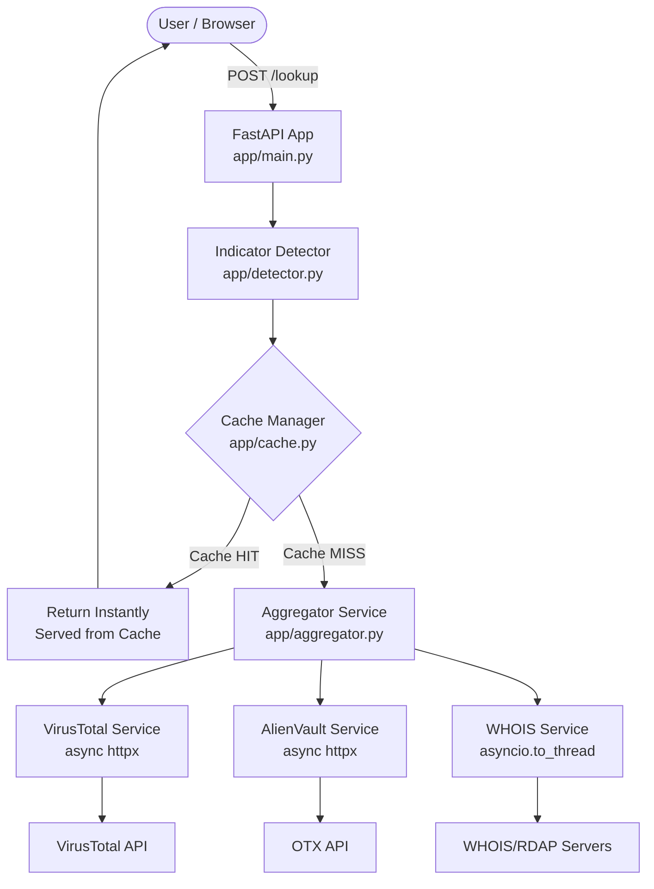

# Threat Intelligence Lookup Service

An automated Threat Intelligence lookup service that aggregates indicator reputation data from **VirusTotal**, **AlienVault OTX**, and **WHOIS**, packaged with a two-tier caching layer (Redis + local in-memory fallback) and a premium cyberpunk cyber-security dashboard.

---

## Architecture Diagram



---

## Features

- **Automated Indicator Detection**: Detects whether an input is a **URL**, **IP Address**, **Domain Name**, or **File Hash** (MD5, SHA-1, SHA-256).
- **Concurrent API Fetching**: Resolves all configured threat feeds in parallel via asynchronous HTTP streams.
- **Unified Risk Assessment**: Aggregates API responses and scores them into a single 0-100 risk factor rating.
- **Two-Tier Cache**: Uses Redis for caching, automatically falling back to an in-memory dictionary if Redis is offline.
- **Premium Frontend Dashboard**: Cybersecurity-themed dark mode UI with a risk gauge, tabbed outputs, direct cache eviction controls, and ready-to-test examples.

---

## Getting Started

### 1. Configuration (`.env`)

Clone the configuration template:
```bash
cp .env.example .env
```
Open `.env` and fill in your threat intelligence API credentials:
* **VirusTotal API Key**: Register at [VirusTotal](https://www.virustotal.com/) and paste your key.
* **AlienVault OTX API Key**: Register at [AlienVault OTX](https://otx.alienvault.com/) and paste your key.

*Note: The application will run even if keys are empty. Empty services will report status information indicating they are missing configurations.*

### 2. Run Everything in One Command (Docker)

To start the FastAPI web application and Redis cache together, run:
```bash
docker compose up --build
```
This single command builds the FastAPI container, spins up the Redis container, links them within a private network, and exposes the web application.

Once running, access the dashboard at:
👉 **[http://localhost:8000](http://localhost:8000)**

---

## API Documentation

### `POST /lookup`
Submit an indicator to run the aggregated reputation check.
* **Request Body**:
  ```json
  {
    "indicator": "8.8.8.8",
    "force_refresh": false
  }
  ```
* **Response**: Returns the consolidated indicator results, including risk score and cache status:
  ```json
  {
    "indicator": "8.8.8.8",
    "type": "ip",
    "queried_at": "2026-06-17T18:00:00Z",
    "risk_score": 0,
    "results": {
      "virustotal": { ... },
      "alienvault": { ... },
      "whois": { ... }
    },
    "served_from_cache": true
  }
  ```

### `GET /lookup/{indicator}`
Path-style GET request. Matches the POST `/lookup` response format.
* **Example**: `GET /lookup/github.com?force_refresh=true`

### `DELETE /cache/{indicator_type}/{indicator}`
Evicts an entry from the cache.
* **Example**: `DELETE /cache/ip/8.8.8.8`

### `GET /health`
Verifies backend configuration state and cache availability.

---

## How Caching Works

Here is exactly how the caching scenario is handled:

1. **First Query (Cache Miss)**: 
   * **User A** submits a link (e.g., `https://example.com`).
   * The service checks the cache and finds no record.
   * It queries **VirusTotal**, **AlienVault OTX**, and **WHOIS** in parallel.
   * It normalizes the data, saves it to the cache with a 1-hour expiration timer, and returns the result with `"served_from_cache": false`.

2. **Subsequent Query (Cache Hit)**:
   * **User B** submits the exact same link `https://example.com` a minute later.
   * The service checks the cache and finds the pre-computed document.
   * It **instantly** returns the cached data without making any external network requests.
   * The browser receives the results in milliseconds with `"served_from_cache": true`.

*(Note: Users can click the **Force Refresh** button in the dashboard or pass `"force_refresh": true` to bypass the cache and force a live update).*
